# Home · Asenix Desktop (541:168) — spec extraída de Figma

Fuente: IxRzkKKPa5XStlUI6UnpBv «Asenix Web» · modificado 2026-09-08T19:07:28Z · extraído 2026-09-08T19:55:22.960Z · 0 llamadas API

Marco: 1920×13393 · fondo: #030617 · layout: clip

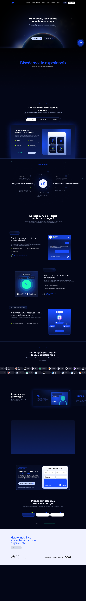

Convenciones: posiciones relativas a la sección (x,y en px); colores `#hex` o `rgba`; tracking en px y em (para `tracking-[…em]`); desenfoques CSS = radio Figma / 2 (convención de Dev Mode, confirmar una vez); ángulo de degradado exacto solo si las asas cruzan el nodo en eje.

## 01 · Header (band:header) — 1920×120 @ y=366

Componente: `src/components/layout/Navbar.tsx`  
Contenedor: relleno — · radio 0 · layout — · efectos —

### Textos (3)

| Pos | Texto | Estilo | Familia | Peso | Tamaño | Interlínea | Tracking | Caja | Color | Alineación | Ancho |
|---|---|---|---|---|---|---|---|---|---|---|---|
| 1435,50 | Es |  | Montserrat | 500 | 20 | 16 | 0 | — | #ffffff | center/center | 71 HEIGHT |
| 1548,50 | Iniciar sesion |  | Montserrat | 500 | 15 | 16 | 0 | — | #000000 | center/center | 99 WIDTH_AND_HEIGHT |
| 485,53 | Plataforma       Servicios         Ecosistema        Proyectos       … |  | Montserrat | 600 | 15 | 20 | 0 | — | #ffffff | center/center | 949  |

### Contenedores (6)

| Ruta | Nodo | Pos | Tamaño | Radio | Relleno | Borde | Efectos | Layout | Opac. |
|---|---|---|---|---|---|---|---|---|---|
| Header | Vector (700:2774) | 240,35 | 69×55 |  | #1a4dff |  |  |  |  |
| Header | Servicio Digital experience (871:383) | 1408,35 | 98×46 | 20 | linear-gradient(180deg, #182557 0%, #050b21 99%) |  |  | clip |  |
| ···Frame › Group | Vector (871:388) | 1426,50 | 13×14 |  | #ffffff |  |  |  |  |
| ···Frame › Group | Vector (871:389) | 1435,56 | 9×10 |  | #ffffff |  |  |  |  |
| Header | Servicio Digital experience (873:402) | 1515,35 | 165×46 | 20 | #ffffff |  |  | clip |  |
| ·Header › Servicio Digital experi… | Vector (873:403) | 1556,-267 | 335×329 |  | radial-gradient(168px 164px at 50% 50%, #1a4dff 0%, rgba(46,107,255,0.12) 81%, rgba(46,107,255,0) 100%) |  | filter: blur(7.3px) |  |  |

_Nodos ocultos: 0 · nodos más profundos que 6: 0_

## 02 · Hero (band:hero) — 1920×786 @ y=486

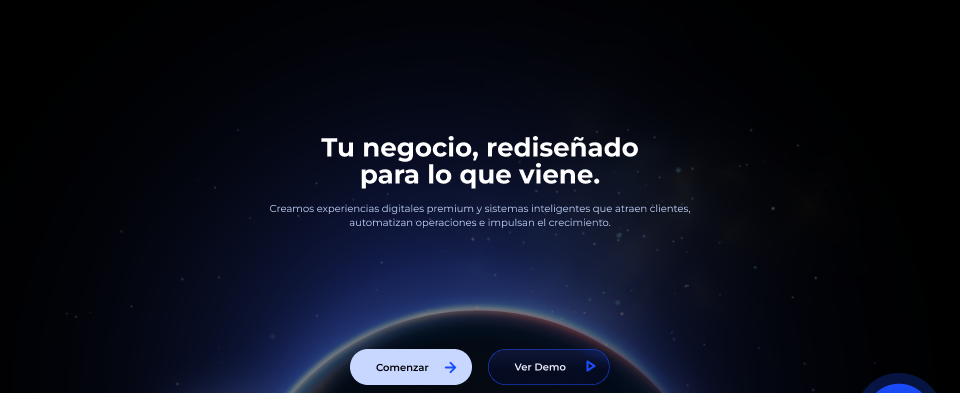

Componente: `src/components/sections/Hero.tsx`  
Contenedor: relleno — · radio 0 · layout — · efectos —

### Textos (4)

| Pos | Texto | Estilo | Familia | Peso | Tamaño | Interlínea | Tracking | Caja | Color | Alineación | Ancho |
|---|---|---|---|---|---|---|---|---|---|---|---|
| 578,276 | Tu negocio, rediseñado para lo que viene. |  | Montserrat | 700 | 52 | 54 | 0 | — | #ffffff | center/center | 764  |
| 484,398 | Creamos experiencias digitales premium y sistemas inteligentes que at… |  | Montserrat | 400 | 20 | 28 | 0 | — | #c7d7ff | center/center | 952  |
| 752,723 | Comenzar |  | Montserrat | 600 | 20 | 16 | 0 | — | #010104 | left/center | 139  |
| 1029,726 | Ver Demo |  | Montserrat | 600 | 20 | 16 | 0 | — | #ecefff | left/center | 139  |

### Contenedores (6)

| Ruta | Nodo | Pos | Tamaño | Radio | Relleno | Borde | Efectos | Layout | Opac. |
|---|---|---|---|---|---|---|---|---|---|
| Hero | Fondo-30 1 (1272:4340) | 0,-120 | 1921×1080 |  | image(d3c90fbf…, FILL) + rgba(0,0,0,0.5) |  |  |  |  |
| Hero | Rectangle 20 (541:219) | 700,698 | 244×72 | 47 | #c7d7ff |  |  |  |  |
| Hero | Servicio Digital experience (873:395) | 976,698 | 243×72 | 50 | linear-gradient(180deg, #101837 0%, #050b21 61%) | #1a4dff 1px inside |  | clip |  |
| ·Hero › Servicio Digital experi… | Vector (873:396) | 1037,126 | 493×615 |  | linear-gradient(90deg, #1a4dff 0%, rgba(46,107,255,0.12) 81%, rgba(46,107,255,0) 100%) |  | filter: blur(7.3px) |  |  |
| ·Hero › Arrow right | Icon (I1198:2195;7758:11060) | 892,726 | 19×19 |  |  | #1a4dff 4px center |  |  |  |
| ·Hero › Play | Icon (I1198:2192;7758:12092) | 1175,723 | 14×18 |  |  | #1a4dff 4px center |  |  |  |

_Nodos ocultos: 0 · nodos más profundos que 6: 0_

## 03 · El futuro (band:el-futuro) — 1920×1679 @ y=1272

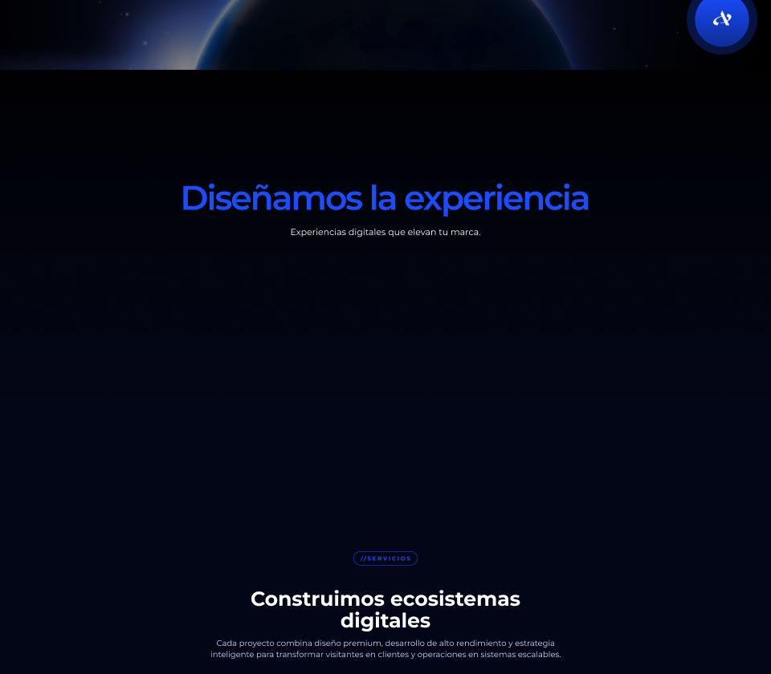

Componente: `src/components/sections/Evolution.tsx`  
Contenedor: relleno — · radio 0 · layout — · efectos —

### Textos (10)

| Pos | Texto | Estilo | Familia | Peso | Tamaño | Interlínea | Tracking | Caja | Color | Alineación | Ancho |
|---|---|---|---|---|---|---|---|---|---|---|---|
| 238,453 | Diseñamos la experiencia |  | Montserrat | 600 | 85 | 20 | -4.25px (-0.05em) | — | #1a4dff | center/center | 1444  |
| 458,548 | Experiencias digitales que elevan tu marca. |  | Montserrat | 400 | 22 | 28 | 0 | — | #ffffff | center/center | 1004  |
| 778,129 | //el futuro de los negocios |  | Montserrat | 300 | 14 | 22 | 3.5px (0.25em) | — | #1a4dff | center/center | 366  |
| ↳ | // | | = | 700 | = | = | = | = | #1a4dff | | |
| ↳ | el futuro de los negocios | | = | 700 | = | = | = | UPPER | #1a4dff | | |
| 609,1473 | Construimos ecosistemas digitales |  | Montserrat | 700 | 50 | 54 | 0 | — | #ffffff | center/center | 702  |
| 883,1380 | //servicios |  | Montserrat | 300 | 14 | 22 | 3.5px (0.25em) | — | #1a4dff | center/center | 154  |
| ↳ | // | | = | 700 | = | = | = | = | #1a4dff | | |
| ↳ | servicios | | = | 700 | = | = | = | UPPER | #1a4dff | | |
| 496,1589 | Cada proyecto combina diseño premium, desarrollo de alto rendimiento … |  | Montserrat | 400 | 20 | 28 | 0 | — | #c7d7ff | center/top | 929  |

### Contenedores (7)

| Ruta | Nodo | Pos | Tamaño | Radio | Relleno | Borde | Efectos | Layout | Opac. |
|---|---|---|---|---|---|---|---|---|---|
| ·El futuro › Frame 164 | Vector (863:358) | 1776,26 | 45×37 |  | #ffffff |  |  |  |  |
| ·El futuro › El futuro | Rectangle 2 (541:202) | 0,0 | 1920×1080 |  | linear-gradient(180deg, #000000 0%, rgba(0,0,0,0) 100%) |  |  |  |  |
| ··El futuro › Frame 213 | Servicio Digital experience (1298:5616) | 778,123 | 366×35 | 50 |  | #1a4dff 1px inside |  | clip |  |
| ···Frame 213 › Servicio Digital experi… | Vector (1298:5617) | 909,-284 | 420×429 |  | radial-gradient(210px 214px at 50% 50%, #1a4dff 0%, rgba(46,107,255,0.12) 81%, rgba(46,107,255,0) 100%) |  | filter: blur(7.3px) |  |  |
| ·El futuro › El futuro | Rectangle 179 (1298:5609) | 885,3 | 164×120 |  | #d9d9d9 |  |  |  |  |
| ··Frame 236 › Frame 213 | Servicio Digital experience (1198:2204) | 880,1374 | 160×35 | 50 |  | #1a4dff 1px inside |  | clip |  |
| ···Frame 213 › Servicio Digital experi… | Vector (1198:2205) | 908,967 | 420×429 |  | radial-gradient(210px 214px at 50% 50%, #1a4dff 0%, rgba(46,107,255,0.12) 81%, rgba(46,107,255,0) 100%) |  | filter: blur(7.3px) |  |  |

_Nodos ocultos: 0 · nodos más profundos que 6: 2_

## 04 · Servicios (band:servicios) — 1920×949 @ y=2951

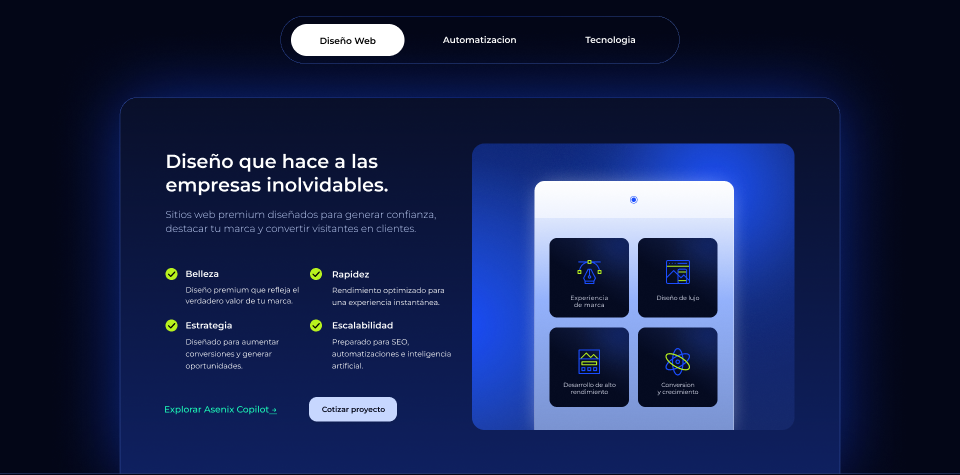

Componente: `src/components/sections/Services.tsx`  
Contenedor: relleno — · radio 0 · layout — · efectos —

### Textos (20)

| Pos | Texto | Estilo | Familia | Peso | Tamaño | Interlínea | Tracking | Caja | Color | Alineación | Ancho |
|---|---|---|---|---|---|---|---|---|---|---|---|
| 1123,590 | Experiencia⏎de marca |  | Montserrat | 400 | 12 | 14 | 0.6px (0.05em) | — | #ecefff | center/top | 111  |
| 1302,590 | Diseño de lujo |  | Montserrat | 400 | 12 | 14 | 0 | — | #ecefff | center/top | 108  |
| 1111,769 | Desarrollo de alto rendimiento |  | Montserrat | 400 | 12 | 14 | 0 | — | #ecefff | center/bottom | 136  |
| 1276,771 | Conversion⏎y crecimiento |  | Montserrat | 400 | 12 | 14 | 0 | — | #ecefff | center/bottom | 160  |
| 331,300 | Diseño que hace a las empresas inolvidables. |  | Montserrat | 600 | 38 | 47 | 0 | — | #ffffff | left/top | 569  |
| 331,414 | Sitios web premium diseñados para generar confianza, destacar tu marc… |  | Montserrat | 300 | 20 | 28 | 0 | — | #c7d7ff | left/center | 569  |
| 371,673 | Diseñado para aumentar conversiones y generar oportunidades. |  | Montserrat | 400 | 15 | 24 | 0 | — | #ffffff | left/top | 245  |
| 371,640 | Estrategia |  | Montserrat | 600 | 18 | 24 | 0 | — | #ffffff | left/top | 245  |
| 371,537 | Belleza |  | Montserrat | 600 | 18 | 24 | 0 | — | #ffffff | left/top | 245  |
| 371,570 | Diseño premium que refleja el verdadero valor de tu marca. |  | Montserrat | 400 | 15 | 22 | 0 | — | #ffffff | left/top | 245  |
| 664,570 | Rendimiento optimizado para una experiencia instantánea. |  | Montserrat | 400 | 15 | 24 | 0 | — | #ffffff | left/top | 245  |
| 664,538 | Rapidez |  | Montserrat | 600 | 18 | 24 | 0 | — | #ffffff | left/top | 245  |
| 664,673 | Preparado para SEO, automatizaciones e inteligencia artificial. |  | Montserrat | 400 | 15 | 24 | 0 | — | #ffffff | left/top | 245  |
| 664,640 | Escalabilidad |  | Montserrat | 600 | 18 | 24 | 0 | — | #ffffff | left/top | 245  |
| 620,815 | Cotizar proyecto |  | Montserrat | 600 | 15 | 16 | 0 | — | #030617 | center/center | 174  |
| 835,72 | Automatizacion |  | Montserrat | 600 | 18 | 36 | 0 | — | #ffffff | center/center | 249  |
| 1097,64 | Tecnologia |  | Montserrat | 600 | 18 | 36 | 0 | — | #ffffff | center/center | 248  |
| 626,75 | Diseño Web |  | Montserrat | 600 | 18 | 16 | 0 | — | #000000 | center/center | 139  |
| 328,808 | Explorar Asenix Copilot → |  | Montserrat | 500 | 18 | 24 | 0 | — | #1cfcb9 | left/top | 231  |
| ↳ |  → | | = | = | = | = | = | = | = | | |

### Contenedores (25)

| Ruta | Nodo | Pos | Tamaño | Radio | Relleno | Borde | Efectos | Layout | Opac. |
|---|---|---|---|---|---|---|---|---|---|
| Servicios | Servicio Digital experience (546:1520) | 0,0 | 1920×948 | 25 25 0 0 |  |  |  | clip |  |
| ··Servicio Digital experi… › Frame 91 | Rectangle 35 (541:250) | 240,196 | 1440×752 | 35 35 0 0 | linear-gradient(180deg, #101a3e 0%, #1a3ba9 100%) | conic-gradient(#6994ff 32%, #1a4dff 50%, #6994ff 68%) 0.5px… | box-shadow: 0px 0px 150px 0px rgba(26,77,255,0.5) |  |  |
| ··Servicio Digital experi… › Frame 91 | Servicio Digital experience (541:253) | 944,288 | 645×573 | 25 | linear-gradient(180deg, #1a4dff 28%, #294296 100%) |  |  | clip |  |
| ···Frame 91 › Servicio Digital experi… | Vector (541:254) | 1075,21 | 703×711 |  | radial-gradient(352px 356px at 50% 50%, #1a4dff 0%, rgba(46,107,255,0.12) 66%, rgba(46,107,255,0) 100%) |  | filter: blur(40px) |  |  |
| ···Frame 91 › Servicio Digital experi… | Vector (541:255) | 366,145 | 1088×1015 |  | radial-gradient(544px 508px at 50% 50%, #1a4dff 0%, rgba(46,107,255,0.12) 66%, rgba(46,107,255,0) 100%) |  | filter: blur(7.3px) |  |  |
| ···Frame 91 › Servicio Digital experi… | Rectangle 21 (541:256) | 1069,363 | 399×511 | 20 20 0 0 | linear-gradient(180deg, #ffffff 0%, #94b2fc 47%, #7a93d0 100%) | #ffffff 0.5px inside | box-shadow: 0px 0px 50px -13px rgba(255,255,255,0.59) |  |  |
| ···Frame 91 › Servicio Digital experi… | Rectangle 22 (1203:2240) | 1069,363 | 399×74 | 20 20 0 0 | rgba(255,255,255,0.5) |  |  |  |  |
| ···Frame 91 › Servicio Digital experi… | Servicio Digital experience (546:1494) | 1099,477 | 159×159 | 15 | linear-gradient(180deg, #101a3e 0%, #050b21 61%) |  |  | clip |  |
| ····Servicio Digital experi… › Servicio Digital experi… | Vector (546:1495) | 1150,402 | 180×178 |  | radial-gradient(90px 89px at 50% 50%, #1a4dff 0%, rgba(46,107,255,0.12) 81%, rgba(46,107,255,0) 100%) |  | filter: blur(7.3px) |  |  |
| ···Frame 91 › Servicio Digital experi… | Servicio Digital experience (546:1500) | 1099,656 | 159×159 | 15 | linear-gradient(180deg, #101a3e 0%, #050b21 61%) |  |  | clip |  |
| ····Servicio Digital experi… › Servicio Digital experi… | Vector (546:1501) | 1150,581 | 180×178 |  | radial-gradient(90px 89px at 50% 50%, #1a4dff 0%, rgba(46,107,255,0.12) 81%, rgba(46,107,255,0) 100%) |  | filter: blur(7.3px) |  |  |
| ···Frame 91 › Servicio Digital experi… | Servicio Digital experience (546:1498) | 1276,477 | 159×159 | 15 | linear-gradient(180deg, #101a3e 0%, #050b21 61%) |  |  | clip |  |
| ····Servicio Digital experi… › Servicio Digital experi… | Vector (546:1499) | 1327,402 | 180×178 |  | radial-gradient(90px 89px at 50% 50%, #1a4dff 0%, rgba(46,107,255,0.12) 81%, rgba(46,107,255,0) 100%) |  | filter: blur(7.3px) |  |  |
| ···Frame 91 › Servicio Digital experi… | Servicio Digital experience (546:1502) | 1276,656 | 159×159 | 15 | linear-gradient(180deg, #101a3e 0%, #050b21 61%) |  |  | clip |  |
| ····Servicio Digital experi… › Servicio Digital experi… | Vector (546:1503) | 1327,581 | 180×178 |  | radial-gradient(90px 89px at 50% 50%, #1a4dff 0%, rgba(46,107,255,0.12) 81%, rgba(46,107,255,0) 100%) |  | filter: blur(7.3px) |  |  |
| ···Frame 91 › Servicio Digital experi… | Ellipse 7 (541:297) | 1260,393 | 15×15 |  |  | #1a4dff 1px inside |  |  |  |
| ···Frame 91 › Servicio Digital experi… | Ellipse 8 (541:298) | 1263,396 | 9×9 |  | #1a4dff |  |  |  |  |
| ·····Frame 230 › Frame 209 | Ellipse 62 (1221:3772) | 331,640 | 24×24 |  | #b8f21e |  |  |  |  |
| ·····Frame 231 › Frame 209 | Ellipse 62 (1221:3764) | 331,537 | 24×24 |  | #b8f21e |  |  |  |  |
| ····Frame 223 › Frame 232 | Ellipse 62 (1221:3872) | 620,537 | 24×24 |  | #b8f21e |  |  |  |  |
| ····Frame 225 › Frame 229 | Ellipse 62 (1221:3878) | 620,640 | 24×24 |  | #b8f21e |  |  |  |  |
| ···Frame 91 › Frame 226 | Rectangle 20 (550:1749) | 618,795 | 176×49 | 16 | #c7d7ff |  | box-shadow: 0px 4px 4px 0px rgba(16,26,62,0.25) |  |  |
| ··Servicio Digital experi… › Menu | Rectangle 29 (693:2647) | 561,33 | 798×95 | 55 |  | conic-gradient(#4977ff 63%, #1a4dff 75%, #6994ff 88%) 0.5px… |  |  |  |
| ··Servicio Digital experi… › Menu | Diseño Web (1198:2207) | 582,49 | 227×64 | 50 | #ffffff |  |  | clip |  |
| Servicios | Vector 8 (541:198) | 0,948 | 1920×0 |  |  | #6994ff 0.5px inside |  |  |  |

_Nodos ocultos: 0 · nodos más profundos que 6: 22_

## 05 · Cómo trabajamos (band:como-trabajamos) — 1920×1036 @ y=3900

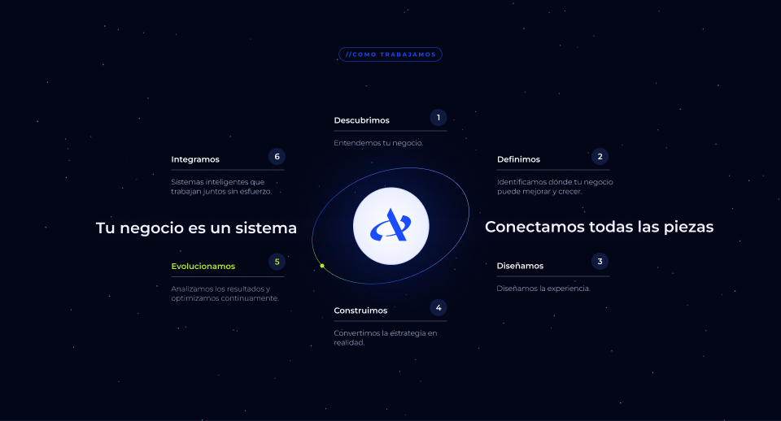

Componente: `src/components/sections/Ecosystem.tsx`  
Contenedor: relleno — · radio 0 · layout — · efectos —

### Textos (24)

| Pos | Texto | Estilo | Familia | Peso | Tamaño | Interlínea | Tracking | Caja | Color | Alineación | Ancho |
|---|---|---|---|---|---|---|---|---|---|---|---|
| 849,122 | //como trabajamos |  | Montserrat | 300 | 14 | 22 | 3.5px (0.25em) | — | #1a4dff | center/center | 222  |
| ↳ | // | | = | 700 | = | = | = | = | #1a4dff | | |
| ↳ | como trabajamos | | = | 700 | = | = | = | UPPER | #1a4dff | | |
| 1072,282 | 1 |  | Montserrat | 600 | 20 | 22 | 0 | UPPER | #ffffff | center/center | 13  |
| 821,284 | Descubrimos |  | Montserrat | 600 | 20 | 23 | 0 | — | #ffffff | left/top | 239  |
| 821,340 | Entendemos tu negocio. |  | Montserrat | 300 | 18 | 23 | 0 | — | #c7d7ff | left/top | 278  |
| 675,378 | 6 |  | Montserrat | 600 | 20 | 22 | 0 | UPPER | #ffffff | center/center | 13  |
| 675,378 | 6 |  | Montserrat | 600 | 20 | 22 | 0 | UPPER | #ffffff | center/center | 13  |
| 1469,378 | 2 |  | Montserrat | 600 | 20 | 22 | 0 | UPPER | #ffffff | center/center | 13  |
| 421,380 | Integramos |  | Montserrat | 600 | 20 | 23 | 0 | — | #ffffff | left/top | 289  |
| 1222,380 | Definimos |  | Montserrat | 600 | 20 | 23 | 0 | — | #ffffff | left/top | 242  |
| 421,436 | Sistemas inteligentes que trabajan juntos sin esfuerzo. |  | Montserrat | 300 | 18 | 23 | 0 | — | #c7d7ff | left/top | 307  |
| 1222,436 | Identificamos dónde tu negocio puede mejorar y crecer. |  | Montserrat | 300 | 18 | 23 | 0 | — | #c7d7ff | left/top | 296  |
| 1192,539 | Conectamos todas las piezas |  | Montserrat | 600 | 38 | 36 | 0 | — | #f1f3fe | left/top | 578  |
| 222,542 | Tu negocio es un sistema |  | Montserrat | 600 | 38 | 36 | 0 | — | #f1f3fe | right/top | 509  |
| 1469,636 | 3 |  | Montserrat | 600 | 20 | 22 | 0 | UPPER | #ffffff | center/center | 13  |
| 675,637 | 5 |  | Montserrat | 600 | 20 | 22 | 0 | UPPER | #b8f21e | center/center | 13  |
| 1221,642 | Diseñamos |  | Montserrat | 600 | 20 | 23 | 0 | — | #ffffff | left/top | 235  |
| 421,643 | Evolucionamos |  | Montserrat | 600 | 20 | 23 | 0 | — | #b8f21e | left/top | 221  |
| 1221,698 | Diseñamos la experiencia. |  | Montserrat | 300 | 18 | 23 | 0 | — | #c7d7ff | left/top | 287  |
| 421,699 | Analizamos los resultados y optimizamos continuamente. |  | Montserrat | 300 | 18 | 23 | 0 | — | #a7b2d1 | left/top | 278  |
| 1072,750 | 4 |  | Montserrat | 600 | 20 | 22 | 0 | UPPER | #ffffff | center/center | 13  |
| 821,752 | Construimos |  | Montserrat | 600 | 20 | 23 | 0 | — | #ffffff | left/top | 281  |
| 821,808 | Convertimos la estrategia en realidad. |  | Montserrat | 300 | 18 | 23 | 0 | — | #c7d7ff | left/top | 278  |

### Contenedores (23)

| Ruta | Nodo | Pos | Tamaño | Radio | Relleno | Borde | Efectos | Layout | Opac. |
|---|---|---|---|---|---|---|---|---|---|
| Cómo trabajamos | image (541:421) | 0,0 | 1920×1036 |  | image(dfd0d85a…, STRETCH) |  |  | clip | 0.9 |
| ·Cómo trabajamos › Frame 214 | Servicio Digital experience (1198:2213) | 833,116 | 254×35 | 50 |  | #1a4dff 1px inside |  | clip |  |
| ··Frame 214 › Servicio Digital experi… | Vector (1198:2214) | 908,-291 | 420×429 |  | radial-gradient(210px 214px at 50% 50%, #1a4dff 0%, rgba(46,107,255,0.12) 81%, rgba(46,107,255,0) 100%) |  | filter: blur(7.3px) |  |  |
| ·Cómo trabajamos › Frame 223 | Vector (1206:3345) | 1057,268 | 42×42 |  | #101a3e |  |  |  |  |
| Cómo trabajamos | Vector 12 (541:366) | 821,322 | 278×0 |  | #c7d7ff | #c7d7ff 0.5px center |  |  |  |
| Cómo trabajamos | Vector (541:349) | 728,363 | 464×385 |  |  | conic-gradient(#1a4dff 12%, #94b2fc 58%, #1a4dff 87%, #b8f2… |  |  |  |
| ·Cómo trabajamos › Frame 218 | Vector (1206:3327) | 660,364 | 42×42 |  | #101a3e |  |  |  |  |
| ·Cómo trabajamos › Frame 219 | Vector (1206:3330) | 660,364 | 42×42 |  | #101a3e |  |  |  |  |
| ·Cómo trabajamos › Frame 220 | Vector (1206:3333) | 1454,364 | 42×42 |  | #101a3e |  |  |  |  |
| Cómo trabajamos | Vector 11 (541:364) | 421,418 | 278×0 |  | #c7d7ff | #c7d7ff 0.5px center |  |  |  |
| Cómo trabajamos | Vector 15 (541:365) | 1221,418 | 278×0 |  | #c7d7ff | #c7d7ff 0.5px center |  |  |  |
| Cómo trabajamos | Vector (550:1775) | 869,462 | 185×189 |  | radial-gradient(94px 93px at 50% 50%, #ffffff 0%, #ecefff 100%) | #c7d7ff 2px center | box-shadow: 0px 0px 200px 0px rgba(26,77,255,0.49) |  |  |
| ·Cómo trabajamos › Frame | Vector (550:1777) | 910,542 | 48×51 |  | #1a4dff |  |  |  |  |
| ·Cómo trabajamos › Frame | Vector (550:1778) | 949,530 | 62×52 |  | #1a4dff |  |  |  |  |
| ·Cómo trabajamos › Frame | Vector (550:1779) | 951,511 | 48×82 |  | #1a4dff |  |  |  |  |
| Cómo trabajamos | Rectangle 40 (541:336) | 240,536 | 1349×59 |  | #04071a |  |  |  |  |
| ·Cómo trabajamos › Frame 221 | Vector (1206:3336) | 1454,622 | 42×42 |  | #101a3e |  |  |  |  |
| ·Cómo trabajamos › Frame 25 | Vector (541:370) | 660,623 | 42×42 |  | #101a3e |  |  |  |  |
| Cómo trabajamos | Vector (541:357) | 787,649 | 10×10 |  | #b8f21e |  |  |  |  |
| Cómo trabajamos | Vector 14 (541:368) | 1221,680 | 278×0 |  | #c7d7ff | #c7d7ff 0.5px center |  |  |  |
| Cómo trabajamos | Vector 10 (541:363) | 421,681 | 278×0 |  |  | #c7d7ff 0.5px center |  |  |  |
| ·Cómo trabajamos › Frame 222 | Vector (1206:3342) | 1057,736 | 42×42 |  | #101a3e |  |  |  |  |
| Cómo trabajamos | Vector 13 (541:367) | 821,790 | 278×0 |  | #c7d7ff | #c7d7ff 0.5px center |  |  |  |

_Nodos ocultos: 0 · nodos más profundos que 6: 0_

## 06 · Proceso (band:proceso) — 1920×3040 @ y=4936

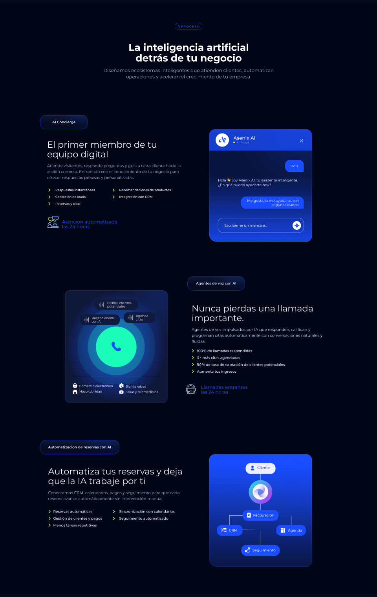

Componente: `src/components/sections/Process.tsx`  
Contenedor: relleno — · radio 0 · layout — · efectos —

### Textos (37)

| Pos | Texto | Estilo | Familia | Peso | Tamaño | Interlínea | Tracking | Caja | Color | Alineación | Ancho |
|---|---|---|---|---|---|---|---|---|---|---|---|
| 849,123 | //proceso |  | Montserrat | 300 | 14 | 22 | 3.5px (0.25em) | — | #1a4dff | center/center | 222  |
| ↳ | // | | = | 700 | = | = | = | = | #1a4dff | | |
| ↳ | proceso | | = | 700 | = | = | = | UPPER | #1a4dff | | |
| 578,214 | La inteligencia artificial detrás de tu negocio |  | Montserrat | 700 | 50 | 54 | 0 | — | #ffffff | center/top | 766  |
| 485,342 | Diseñamos ecosistemas inteligentes que atienden clientes, automatizan… |  | Montserrat | 400 | 24 | 32 | 0 | — | rgba(199,215,255,0.8) | center/top | 951  |
| 256,614 | AI Concierge |  | Montserrat | 600 | 18 | 36 | 0 | — | #ecefff | center/center | 139  |
| 1142,1138 | Escribeme un mensaje... |  | Montserrat | 400 | 18 | 19 | 0 | — | #ffffff | left/top | 233  |
| 1205,715 | En Linea |  | Montserrat | 300 | 15 | 20 | 0 | — | #ecefff | left/top | 165  |
| 1189,692 | Asenix AI |  | Montserrat | 500 | 24 | 20 | 0 | — | #ffffff | left/top | 276  |
| 1249,1012 | Me gustaria me ayudaras con algunas dudas. |  | Montserrat | 400 | 18 | 21 | 0 | — | #ecefff | right/center | 274  |
| 1452,836 | Hola |  | Montserrat | 400 | 18 | 19 | 0 | — | #ecefff | center/center | 95  |
| 1110,906 | Hola 👋 Soy Asenix AI, tu asistente inteligente.¿En qué puedo ayudart… |  | Montserrat | 400 | 18 | 24 | 0 | — | #ecefff | left/top | 437  |
| 240,711 | El primer miembro de tu equipo digital |  | Montserrat | 400 | 45 | 49 | 0 | — | #f1f3fe | left/top | 704  |
| 240,829 | Atiende visitantes, responde preguntas y guía a cada cliente hacia la… |  | Montserrat | 400 | 20 | 30 | 0 | — | rgba(199,215,255,0.8) | left/top | 704  |
| 282,962 | Respuestas instantáneas⏎Captación de leads       ⏎Reservas y citas |  | Montserrat | 500 | 16 | 35 | 0 | — | #ffffff | left/center | 302  |
| 607,968 | Recomendaciones de productos⏎Integración con CRM  ⏎ |  | Montserrat | 500 | 16 | 35 | 0 | — | #ffffff | left/center | 336  |
| 316,1123 | Atencion automatizada⏎las 24 horas |  | Montserrat | 400 | 24 | 24 | 0 | — | #1a4dff | left/center | 339  |
| 998,1425 | Agentes de voz con AI |  | Montserrat | 600 | 18 | 36 | 0 | — | #ecefff | center/center | 206 WIDTH_AND_HEIGHT |
| 639,1965 | Bienes raices⏎Salud y telemedicina |  | Montserrat | 400 | 16 | 28 | 0 | — | #ffffff | left/center | 170  |
| 404,1963 | Comercio electronico⏎Hospitabilidad |  | Montserrat | 400 | 16 | 28 | 0 | — | #ffffff | left/center | 189  |
| 692,1600 | Agenda⏎citas |  | Montserrat | 400 | 16 | 18 | 0 | — | #ffffff | left/center | 70  |
| 546,1534 | Califica clientes⏎potenciales |  | Montserrat | 400 | 16 | 18 | 0 | — | #ffffff | left/center | 127  |
| 467,1611 | Recepcionista⏎con Ai |  | Montserrat | 400 | 16 | 18 | 0 | — | #ffffff | left/center | 118  |
| 976,1545 | Nunca pierdas una llamada importante. |  | Montserrat | 400 | 45 | 49 | 0 | — | #f1f3fe | left/top | 708  |
| 976,1663 | Agentes de voz impulsados por IA que responden, califican y programan… |  | Montserrat | 400 | 20 | 30 | 0 | — | #c7d7ff | left/top | 708  |
| 1003,1772 | 100 % de llamadas respondidas⏎3 × más citas agendadas⏎90 % de tasa de… |  | Montserrat | 500 | 18 | 35 | 0 | — | #ecefff | left/center | 536  |
| 1023,1965 | Llamadas entrantes⏎las 24 horas |  | Montserrat | 400 | 24 | 25 | 0 | — | #1a4dff | left/center | 246  |
| 211,2269 | Automatizacion de reservas con AI |  | Montserrat | 600 | 18 | 36 | 0 | — | #ecefff | center/center | 389  |
| 1310,2365 | Cliente |  | Montserrat | 500 | 18 | 18 | 0 | — | #294296 | left/center | 91  |
| 1166,2684 | CRM |  | Montserrat | 500 | 18 | 18 | 0 | — | #ecefff | left/center | 55  |
| 1467,2684 | Agenda |  | Montserrat | 500 | 18 | 18 | 0 | — | #ecefff | left/center | 91  |
| 1289,2607 | Facturacion |  | Montserrat | 500 | 18 | 18 | 0 | — | #ecefff | left/center | 114  |
| 1286,2785 | Seguimiento |  | Montserrat | 500 | 18 | 18 | 0 | — | #ecefff | left/center | 131  |
| 245,2375 | Automatiza tus reservas y deja que la IA trabaje por ti |  | Montserrat | 400 | 45 | 49 | 0 | — | #f1f3fe | left/top | 703  |
| 245,2494 | Conectamos CRM, calendarios, pagos y seguimiento para que cada reserv… |  | Montserrat | 400 | 20 | 30 | 0 | — | #a7b2d1 | left/top | 703  |
| 271,2599 | Reservas automáticas⏎Gestión de clientes y pagos         ⏎Menos tarea… |  | Montserrat | 500 | 18 | 35 | 0 | — | #ecefff | left/center | 317  |
| 607,2599 | Sincronización con calendarios⏎Seguimiento automatizado          ⏎ |  | Montserrat | 500 | 18 | 35 | 0 | — | #ecefff | left/center | 337  |

### Contenedores (82)

| Ruta | Nodo | Pos | Tamaño | Radio | Relleno | Borde | Efectos | Layout | Opac. |
|---|---|---|---|---|---|---|---|---|---|
| Proceso | Vector 20 (550:1706) | 0,0 | 1920×0 |  |  | #6994ff 0.5px inside |  |  |  |
| ·Proceso › Frame 215 | Servicio Digital experience (1198:2220) | 890,117 | 140×35 | 50 |  | #1a4dff 1px inside |  | clip |  |
| ··Frame 215 › Servicio Digital experi… | Vector (1198:2221) | 908,-290 | 420×429 |  | radial-gradient(210px 214px at 50% 50%, #1a4dff 0%, rgba(46,107,255,0.12) 81%, rgba(46,107,255,0) 100%) |  | filter: blur(7.3px) |  |  |
| Proceso | Diseño Web (1226:3891) | 204,586 | 243×72 | 30 | linear-gradient(180deg, #101837 0%, #050b21 61%) | #1a4dff 1px inside |  | clip |  |
| ·Proceso › Diseño Web | Vector (1226:3892) | 325,372 | 299×286 |  | linear-gradient(90deg, #1a4dff 0%, rgba(46,107,255,0.12) 81%, rgba(46,107,255,0) 100%) |  | filter: blur(24.1px) |  |  |
| Proceso | Servicio Digital experience (681:3746) | 1065,658 | 524×573 | 30 30 30 39 | linear-gradient(180deg, #0a1540 0%, #1a4dff 100%) | linear-gradient(0deg, #6994ff 0%, #1a4dff 100%) 1.5px inside |  | clip |  |
| ·Proceso › Servicio Digital experi… | Vector (681:3747) | 1220,392 | 612×586 |  | radial-gradient(306px 293px at 50% 50%, #1a4dff 0%, rgba(46,107,255,0) 100%) |  | filter: blur(7.3px) |  |  |
| ·Proceso › Servicio Digital experi… | Rectangle 72 (681:3766) | 1110,1111 | 437×73 | 25 |  | #c7d7ff 1px center |  |  |  |
| ·Proceso › Servicio Digital experi… | Ellipse 1 (681:3768) | 1490,1126 | 43×44 |  | #ffffff |  |  |  |  |
| ·Proceso › Servicio Digital experi… | Servicio Digital experience (681:3772) | 1065,658 | 524×109 | 30 30 0 0 | rgba(26,77,255,0.75) |  |  | clip |  |
| ··Servicio Digital experi… › Servicio Digital experi… | Ellipse 17 (681:3777) | 1188,721 | 8×8 |  | #b8f21e |  |  |  |  |
| ···Servicio Digital experi… › Frame | Vector (681:3780) | 1527,709 | 16×16 |  |  | #ffffff 2px center |  |  |  |
| ···Servicio Digital experi… › Frame | Vector (681:3781) | 1527,709 | 16×16 |  |  | #ffffff 2px center |  |  |  |
| ··Servicio Digital experi… › Servicio Digital experi… | Ellipse 1 (681:3775) | 1098,679 | 68×68 |  | #ffffff |  |  |  |  |
| ··Servicio Digital experi… › Servicio Digital experi… | Vector (681:3776) | 1114,695 | 36×30 |  | #1a4dff |  |  |  |  |
| ·Proceso › Servicio Digital experi… | Rectangle 108 (681:3754) | 1227,1001 | 320×62 | 25 25 5 25 | #1a4dff |  |  |  |  |
| ·Proceso › Servicio Digital experi… | Rectangle 69 (681:3751) | 1452,814 | 95×62 | 25 25 5 25 | #1a4dff |  |  |  |  |
| ·Proceso › Chevron right | Icon (I1214:3461;7758:11234) | 249,962 | 7×13 |  |  | #b8f21e 3px center |  |  |  |
| ·Proceso › Chevron right | Icon (I1214:3465;7758:11234) | 576,962 | 7×13 |  |  | #b8f21e 3px center |  |  |  |
| ·Proceso › Chevron right | Icon (I1214:3459;7758:11234) | 249,997 | 7×13 |  |  | #b8f21e 3px center |  |  |  |
| ·Proceso › Chevron right | Icon (I1214:3464;7758:11234) | 576,997 | 7×13 |  |  | #b8f21e 3px center |  |  |  |
| ·Proceso › Chevron right | Icon (I1214:3456;7758:11234) | 249,1031 | 7×13 |  |  | #b8f21e 3px center |  |  |  |
| ···Group › Group | Vector (917:3569) | 246,1105 | 30×25 |  | #b8f21e |  |  |  |  |
| ···Group › Group | Vector (917:3570) | 275,1108 | 3×3 |  | #b8f21e |  |  |  |  |
| ···Group › Group | Vector (917:3571) | 280,1108 | 3×3 |  | #b8f21e |  |  |  |  |
| ···Group › Group | Vector (917:3572) | 286,1108 | 3×3 |  | #b8f21e |  |  |  |  |
| ···Group › Group | Vector (917:3574) | 265,1100 | 33×25 |  | #94b2fc |  |  |  |  |
| ···Group › Group | Vector (917:3575) | 242,1128 | 56×32 |  | #94b2fc |  |  |  |  |
| Proceso | Diseño Web (1245:316) | 955,1407 | 292×72 | 30 | linear-gradient(180deg, #101837 0%, #050b21 61%) | #1a4dff 1px inside |  | clip |  |
| ·Proceso › Diseño Web | Vector (1245:317) | 1100,1193 | 359×286 |  | linear-gradient(90deg, #1a4dff 0%, rgba(46,107,255,0.12) 81%, rgba(46,107,255,0) 100%) |  | filter: blur(24.1px) |  |  |
| ·Proceso › Diseño Web | Frame 233 (1245:319) | 988,1415 | 226×56 |  |  |  |  | H justify=center align=center pad=10 gap=10 |  |
| Proceso | Servicio Digital experience (541:692) | 331,1479 | 522×573 | 25 | radial-gradient(286px 261px at 50% 50%, #1a4dff 0%, #101837 100%) | linear-gradient(180deg, #6994ff 0%, #1a4dff 100%) 1.5px ins… |  | clip |  |
| ·Proceso › Servicio Digital experi… | Vector (541:693) | 578,1276 | 484×490 |  | radial-gradient(242px 245px at 50% 50%, #1a4dff 0%, rgba(46,107,255,0.12) 81%, rgba(46,107,255,0) 100%) |  | filter: blur(7.3px) |  |  |
| ·Proceso › Servicio Digital experi… | Line 5 (917:3584) | 375,1915 | 434×0 |  |  | #c7d7ff 1px center |  |  |  |
| ··Servicio Digital experi… › Frame 155 | Servicio Digital experience (924:7928) | 630,1590 | 161×55 | 25 | #101a3e |  |  | clip |  |
| ···Frame 155 › Servicio Digital experi… | Vector (924:7929) | 369,703 | 390×924 |  | radial-gradient(195px 462px at 50% 50%, #1a4dff 0%, rgba(46,107,255,0.12) 81%, rgba(46,107,255,0) 100%) |  | filter: blur(7.3px) |  |  |
| ··Servicio Digital experi… › Frame 156 | Servicio Digital experience (924:7294) | 482,1524 | 222×55 | 25 | #101a3e |  |  | clip |  |
| ···Frame 156 › Servicio Digital experi… | Vector (924:7295) | 122,637 | 537×924 |  | radial-gradient(269px 462px at 50% 50%, #1a4dff 0%, rgba(46,107,255,0.12) 81%, rgba(46,107,255,0) 100%) |  | filter: blur(7.3px) |  |  |
| ··Servicio Digital experi… › Frame 157 | Servicio Digital experience (924:7693) | 406,1601 | 204×55 | 25 | #101a3e |  |  | clip |  |
| ···Frame 157 › Servicio Digital experi… | Vector (924:7694) | 75,714 | 494×924 |  | radial-gradient(247px 462px at 50% 50%, #1a4dff 0%, rgba(46,107,255,0.12) 81%, rgba(46,107,255,0) 100%) |  | filter: blur(7.3px) |  |  |
| ··Servicio Digital experi… › chimenea-de-la-casa 1 | Vector (924:8190) | 371,1984 | 22×22 |  | #ffffff |  |  |  |  |
| ··Servicio Digital experi… › cesta-de-compras-menos 1 | Vector (924:8194) | 371,1952 | 22×22 |  | #ffffff |  |  |  |  |
| ··Servicio Digital experi… › llave-de-casa 1 | Vector (924:8196) | 608,1952 | 22×22 |  | #ffffff |  |  |  |  |
| ··Servicio Digital experi… › medico 1 | Vector (924:8198) | 607,1985 | 22×20 |  | #ffffff |  |  |  |  |
| ·Proceso › Chevron right | Icon (I1214:3477;7758:11234) | 980,1780 | 7×13 |  |  | #b8f21e 3px center |  |  |  |
| ·Proceso › Chevron right | Icon (I1214:3476;7758:11234) | 980,1815 | 7×13 |  |  | #b8f21e 3px center |  |  |  |
| ·Proceso › Chevron right | Icon (I1214:3475;7758:11234) | 980,1850 | 7×13 |  |  | #b8f21e 3px center |  |  |  |
| ·Proceso › Chevron right | Icon (I1214:3481;7758:11234) | 980,1885 | 7×13 |  |  | #b8f21e 3px center |  |  |  |
| ··apoyo-tecnico 1 › Group | Vector (917:3595) | 948,1957 | 48×48 |  | #c7d7ff |  |  |  |  |
| ··apoyo-tecnico 1 › Group | Vector (917:3596) | 965,1989 | 13×8 |  | #b8f21e |  |  |  |  |
| Proceso | Diseño Web (1245:321) | 204,2241 | 404×72 | 30 | linear-gradient(180deg, #101837 0%, #050b21 61%) | #1a4dff 1px inside |  | clip |  |
| ·Proceso › Diseño Web | Vector (1245:322) | 405,2027 | 497×286 |  | linear-gradient(90deg, #1a4dff 0%, rgba(46,107,255,0.12) 81%, rgba(46,107,255,0) 100%) |  | filter: blur(24.1px) |  |  |
| Proceso | Servicio Digital experience (949:9758) | 1065,2313 | 524×573 | 30 30 30 39 | linear-gradient(180deg, #1a4dff 0%, #0a1540 100%) | linear-gradient(180deg, #6994ff 0%, #1a4dff 100%) 1.5px ins… |  | clip |  |
| ·Proceso › Servicio Digital experi… | Vector (949:9759) | 1216,2131 | 612×586 |  | radial-gradient(306px 293px at 50% 50%, #1a4dff 0%, rgba(46,107,255,0) 100%) |  | filter: blur(7.3px) |  |  |
| ·Proceso › Servicio Digital experi… | Servicio Digital experience (964:10941) | 1251,2358 | 152×55 | 25 | #ecefff |  |  | clip |  |
| ··Servicio Digital experi… › Servicio Digital experi… | Vector (964:10942) | 1004,1471 | 368×924 |  | radial-gradient(184px 462px at 50% 50%, #1a4dff 0%, rgba(46,107,255,0.12) 81%, rgba(46,107,255,0) 100%) |  | filter: blur(7.3px) |  |  |
| ····usuario 1 › Group | Vector (964:10945) | 1280,2371 | 12×12 |  | #1a4dff |  |  |  |  |
| ····usuario 1 › Group | Vector (964:10946) | 1277,2385 | 18×10 |  | #1a4dff |  |  |  |  |
| ·Proceso › Servicio Digital experi… | Servicio Digital experience (964:10955) | 1104,2673 | 132×55 | 25 | #1a4dff |  |  | clip |  |
| ··Servicio Digital experi… › Servicio Digital experi… | Vector (964:10956) | 890,1786 | 319×924 |  | radial-gradient(160px 462px at 50% 50%, #1a4dff 0%, rgba(46,107,255,0.12) 81%, rgba(46,107,255,0) 100%) |  | filter: blur(7.3px) |  |  |
| ··Servicio Digital experi… › Servicio Digital experi… | Vector (964:10977) | 1129,2688 | 24×22 |  | #ffffff |  |  |  |  |
| ·Proceso › Servicio Digital experi… | Servicio Digital experience (964:10962) | 1406,2673 | 152×55 | 25 | #1a4dff |  |  | clip |  |
| ··Servicio Digital experi… › Servicio Digital experi… | Vector (964:10963) | 1159,1786 | 368×924 |  | radial-gradient(184px 462px at 50% 50%, #1a4dff 0%, rgba(46,107,255,0.12) 81%, rgba(46,107,255,0) 100%) |  | filter: blur(7.3px) |  |  |
| ···Servicio Digital experi… › auditoria-alternativa 1 | Vector (964:10981) | 1430,2689 | 22×24 |  | #ffffff |  |  |  |  |
| ·Proceso › Servicio Digital experi… | Servicio Digital experience (964:10969) | 1236,2597 | 183×55 | 25 | #1a4dff |  |  | clip |  |
| ··Servicio Digital experi… › Servicio Digital experi… | Vector (964:10970) | 939,1710 | 443×924 |  | radial-gradient(221px 462px at 50% 50%, #1a4dff 0%, rgba(46,107,255,0.12) 81%, rgba(46,107,255,0) 100%) |  | filter: blur(7.3px) |  |  |
| ···Servicio Digital experi… › recibo 1 | Vector (964:10983) | 1258,2611 | 19×26 |  | #ffffff |  |  |  |  |
| ·Proceso › Servicio Digital experi… | Servicio Digital experience (980:12766) | 1229,2775 | 196×55 | 25 | #1a4dff |  |  | clip |  |
| ··Servicio Digital experi… › Servicio Digital experi… | Vector (980:12767) | 911,1888 | 474×924 |  | radial-gradient(237px 462px at 50% 50%, #1a4dff 0%, rgba(46,107,255,0.12) 81%, rgba(46,107,255,0) 100%) |  | filter: blur(7.3px) |  |  |
| ··Servicio Digital experi… › seguimiento-de-ubicacio… | Vector (980:12772) | 1247,2787 | 26×26 |  | #ffffff |  |  |  |  |
| ·Proceso › Servicio Digital experi… | Vector 22 (982:12773) | 1327,2413 | 0×37 |  |  | #ffffff 1px center |  |  |  |
| ·Proceso › Servicio Digital experi… | Vector 26 (1214:3490) | 1325,2701 | 0×74 |  |  | #ffffff 1px center |  |  |  |
| ·Proceso › Servicio Digital experi… | Vector 28 (1216:3495) | 1236,2698 | 170×1 |  |  | #ffffff 1px center |  |  |  |
| ·Proceso › Servicio Digital experi… | Vector 27 (1214:3491) | 1327,2558 | 0×39 |  |  | #ffffff 1px center |  |  |  |
| ·Proceso › Servicio Digital experi… | Vector 29 (1216:3570) | 1419,2627 | 67×47 |  |  | #ffffff 1px center |  |  |  |
| ··Servicio Digital experi… › Frame | aaaa 1 (965:12734) | 1260,2438 | 134×134 |  | image(1fd5b047…, FILL) |  |  |  |  |
| ·Proceso › Chevron right | Icon (I1216:3691;7758:11234) | 250,2599 | 7×13 |  |  | #b8f21e 3px center |  |  |  |
| ·Proceso › Chevron right | Icon (I1216:3693;7758:11234) | 577,2599 | 7×13 |  |  | #b8f21e 3px center |  |  |  |
| Proceso | Vector 29 (1216:3533) | 1169,2625 | 67×47 |  |  | #ffffff 1px center |  |  |  |
| ·Proceso › Chevron right | Icon (I1216:3690;7758:11234) | 250,2634 | 7×13 |  |  | #b8f21e 3px center |  |  |  |
| ·Proceso › Chevron right | Icon (I1216:3692;7758:11234) | 577,2634 | 7×13 |  |  | #b8f21e 3px center |  |  |  |
| ·Proceso › Chevron right | Icon (I1216:3689;7758:11234) | 250,2668 | 7×13 |  |  | #b8f21e 3px center |  |  |  |

_Nodos ocultos: 0 · nodos más profundos que 6: 17_

## 07 · Tecnología (band:tecnologia) — 1920×990 @ y=7976

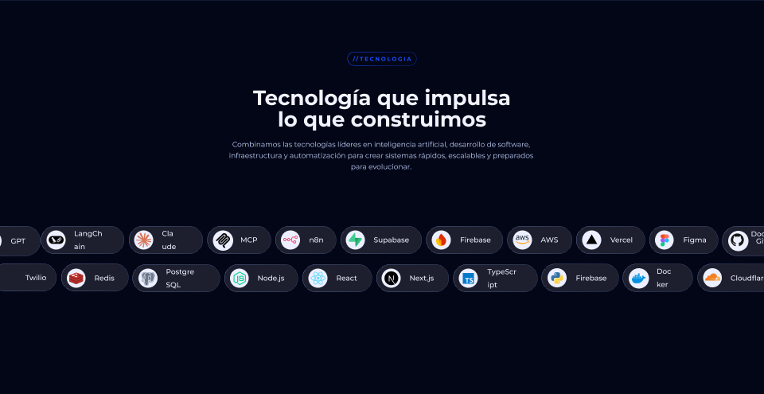

Componente: `src/components/sections/Technology.tsx`  
Contenedor: relleno — · radio 0 · layout — · efectos —

### Textos (27)

| Pos | Texto | Estilo | Familia | Peso | Tamaño | Interlínea | Tracking | Caja | Color | Alineación | Ancho |
|---|---|---|---|---|---|---|---|---|---|---|---|
| 849,136 | //tecnologia |  | Montserrat | 300 | 14 | 22 | 3.5px (0.25em) | — | #1a4dff | center/center | 222  |
| ↳ | // | | = | 700 | = | = | = | = | #1a4dff | | |
| ↳ | tecnologia | | = | 700 | = | = | = | UPPER | #1a4dff | | |
| 609,218 | Tecnología que impulsa⏎lo que construimos |  | Montserrat | 700 | 52 | 54 | 0 | — | #f1f3fe | center/top | 702  |
| 574,349 | Combinamos las tecnologías líderes en inteligencia artificial, desarr… |  | Montserrat | 400 | 18 | 28 | 0 | — | #c7d7ff | center/top | 768  |
| 27,597 | GPT |  | Montserrat | 500 | 18 | 33 | 0 | — | #ecefff | left/center | 37  |
| 1900,597 | GitHub |  | Montserrat | 500 | 18 | 33 | 0 | — | #ecefff | left/center | 89  |
| 1887,580 | Docker |  | Montserrat | 500 | 18 | 33 | 0 | — | #ecefff | left/center | 96  |
| 186,595 | LangChain |  | Montserrat | 500 | 18 | 33 | 0 | — | #ecefff | left/center | 95  |
| 407,595 | Claude |  | Montserrat | 500 | 18 | 33 | 0 | — | #ecefff | left/center | 61  |
| 604,595 | MCP |  | Montserrat | 500 | 18 | 33 | 0 | — | #ecefff | left/center | 73  |
| 777,595 | n8n |  | Montserrat | 500 | 18 | 33 | 0 | — | #ecefff | left/center | 38  |
| 939,595 | Supabase |  | Montserrat | 500 | 18 | 33 | 0 | — | #ecefff | left/center | 115  |
| 1156,595 | Firebase |  | Montserrat | 500 | 18 | 33 | 0 | — | #ecefff | left/center | 96  |
| 1359,595 | AWS |  | Montserrat | 500 | 18 | 33 | 0 | — | #ecefff | left/center | 57  |
| 1534,595 | Vercel |  | Montserrat | 500 | 18 | 33 | 0 | — | #ecefff | left/center | 68  |
| 1717,595 | Figma |  | Montserrat | 500 | 18 | 33 | 0 | — | #ecefff | left/center | 66  |
| 64,689 | Twilio |  | Montserrat | 500 | 18 | 33 | 0 | — | #ecefff | left/center | 70  |
| 1447,690 | Firebase |  | Montserrat | 500 | 18 | 33 | 0 | — | #ecefff | left/center | 96  |
| 1650,690 | Docker |  | Montserrat | 500 | 18 | 33 | 0 | — | #ecefff | left/center | 63  |
| 1836,690 | Cloudflare |  | Montserrat | 500 | 18 | 33 | 0 | — | #ecefff | left/center | 97  |
| 237,691 | Redis |  | Montserrat | 500 | 18 | 33 | 0 | — | #ecefff | left/center | 51  |
| 417,691 | PostgreSQL |  | Montserrat | 500 | 18 | 33 | 0 | — | #ecefff | left/center | 103  |
| 647,691 | Node.js |  | Montserrat | 500 | 18 | 33 | 0 | — | #ecefff | left/center | 73  |
| 845,691 | React |  | Montserrat | 500 | 18 | 33 | 0 | — | #ecefff | left/center | 55  |
| 1029,691 | Next.js |  | Montserrat | 500 | 18 | 33 | 0 | — | #ecefff | left/center | 99  |
| 1225,691 | TypeScript |  | Montserrat | 500 | 18 | 33 | 0 | — | #ecefff | left/center | 95  |

### Contenedores (91)

| Ruta | Nodo | Pos | Tamaño | Radio | Relleno | Borde | Efectos | Layout | Opac. |
|---|---|---|---|---|---|---|---|---|---|
| Tecnología | Vector 17 (949:9804) | 0,0 | 1920×0 |  |  | #6994ff 0.5px inside |  |  |  |
| ·Tecnología › Frame 216 | Servicio Digital experience (1203:2224) | 873,130 | 174×35 | 50 |  | linear-gradient(129deg, #1a4dff 0%, #102e99 100%) 1px inside |  | clip |  |
| ··Frame 216 › Servicio Digital experi… | Vector (1203:2225) | 908,-277 | 420×429 |  | radial-gradient(210px 214px at 50% 50%, #1a4dff 0%, rgba(46,107,255,0.12) 81%, rgba(46,107,255,0) 100%) |  | filter: blur(7.3px) |  |  |
| ·Tecnología › Frame 100 | Rectangle 99 (557:2998) | -58,568 | 160×75 | 47 | rgba(255,255,255,0.1) | linear-gradient(90deg, #94b2fc 0%, #586a96 100%) 0.5px insi… |  |  |  |
| ··Frame 100 › Frame 98 | Ellipse 32 (541:687) | -47,580 | 51×51 |  | #ecefff |  |  |  |  |
| ··Frame 100 › Frame 98 | Vector (541:689) | -41,586 | 39×39 |  | #000000 |  |  |  |  |
| Tecnología | Rectangle 78 (541:602) | 103,568 | 209×70 | 47 | rgba(255,255,255,0.1) | linear-gradient(90deg, #94b2fc 0%, #586a96 100%) 0.5px insi… |  |  |  |
| Tecnología | Rectangle 79 (541:543) | 324,568 | 186×70 | 47 | rgba(255,255,255,0.1) | linear-gradient(90deg, #94b2fc 0%, #586a96 100%) 0.5px insi… |  |  |  |
| Tecnología | Rectangle 80 (541:641) | 521,568 | 160×70 | 47 | rgba(255,255,255,0.1) | linear-gradient(90deg, #94b2fc 0%, #586a96 100%) 0.5px insi… |  |  |  |
| Tecnología | Rectangle 81 (541:657) | 692,568 | 153×70 | 47 | rgba(255,255,255,0.1) | linear-gradient(90deg, #94b2fc 0%, #586a96 100%) 0.5px insi… |  |  |  |
| Tecnología | Rectangle 82 (541:589) | 856,568 | 204×70 | 47 | rgba(255,255,255,0.1) | linear-gradient(90deg, #94b2fc 0%, #586a96 100%) 0.5px insi… |  |  |  |
| Tecnología | Rectangle 83 (541:552) | 1071,568 | 193×70 | 47 | rgba(255,255,255,0.1) | linear-gradient(90deg, #94b2fc 0%, #586a96 100%) 0.5px insi… |  |  |  |
| Tecnología | Rectangle 85 (541:578) | 1275,568 | 163×70 | 47 | rgba(255,255,255,0.1) | linear-gradient(90deg, #94b2fc 0%, #586a96 100%) 0.5px insi… |  |  |  |
| Tecnología | Rectangle 86 (541:528) | 1448,568 | 173×70 | 47 | rgba(255,255,255,0.1) | linear-gradient(90deg, #94b2fc 0%, #586a96 100%) 0.5px insi… |  |  |  |
| Tecnología | Rectangle 95 (541:531) | 1632,568 | 173×70 | 47 | rgba(255,255,255,0.1) | linear-gradient(90deg, #94b2fc 0%, #586a96 100%) 0.5px insi… |  |  |  |
| ·Tecnología › Frame 101 | Rectangle 93 (541:617) | 1815,568 | 192×75 | 47 | rgba(255,255,255,0.1) | linear-gradient(90deg, #94b2fc 0%, #586a96 100%) 0.5px insi… |  |  |  |
| ·Tecnología › Frame 101 | Ellipse 41 (541:619) | 1830,580 | 51×51 |  | #ecefff |  |  |  |  |
| ··Frame 101 › Group | Vector (541:622) | 1837,587 | 33×32 |  | #161614 |  |  |  |  |
| ··Frame 101 › Group | Vector (541:623) | 1842,610 | 7×4 |  | #161614 |  |  |  |  |
| Tecnología | Ellipse 32 (541:606) | 117,579 | 48×48 |  | #ecefff |  |  |  |  |
| Tecnología | Ellipse 33 (541:545) | 337,579 | 48×48 |  | #ecefff |  |  |  |  |
| ·Tecnología › Frame 49 | Ellipse 34 (541:644) | 535,579 | 51×51 |  | #ecefff |  |  |  |  |
| ··Frame 49 › Frame | Vector (541:646) | 543,586 | 35×37 |  | #000000 |  |  |  |  |
| ··Frame 49 › Frame | Vector (541:647) | 548,591 | 24×23 |  | #000000 |  |  |  |  |
| Tecnología | Ellipse 35 (541:660) | 706,579 | 48×48 |  | #ecefff |  |  |  |  |
| Tecnología | Vector (541:591) | 869,579 | 48×48 |  | #3ecf8e |  |  |  |  |
| Tecnología | Ellipse 37 (541:555) | 1085,579 | 48×48 |  | #ecefff |  |  |  |  |
| Tecnología | Ellipse 38 (541:581) | 1289,579 | 48×48 |  | #ecefff |  |  |  |  |
| Tecnología | Ellipse 39 (541:673) | 1463,579 | 48×48 |  | #ecefff |  |  |  |  |
| Tecnología | Ellipse 43 (541:533) | 1646,579 | 47×48 |  | #ecefff |  |  |  |  |
| Tecnología | Vector (541:546) | 342,585 | 38×37 |  | #d97757 |  |  |  |  |
| ··Frame › Group | Vector (541:558) | 1104,613 | 10×5 |  | #ff9100 |  |  |  |  |
| ··Frame › Group | Vector (541:559) | 1096,599 | 12×18 |  | #ffc400 |  |  |  |  |
| ··Frame › Group | Vector (541:560) | 1103,600 | 7×14 |  | #ff9100 |  |  |  |  |
| ··Frame › Group | Vector (541:561) | 1103,587 | 18×30 |  | #dd2c00 |  |  |  |  |
| Tecnología | Vector (541:675) | 1473,589 | 28×24 |  | #000000 |  |  |  |  |
| ·Tecnología › Frame | Vector (541:536) | 1670,599 | 11×10 |  | #1abcfe |  |  |  |  |
| ·Tecnología › Frame | Vector (541:537) | 1660,609 | 11×10 |  | #0acf83 |  |  |  |  |
| ·Tecnología › Frame | Vector (541:538) | 1670,589 | 11×10 |  | #ff7262 |  |  |  |  |
| ·Tecnología › Frame | Vector (541:539) | 1660,589 | 11×10 |  | #f24e1e |  |  |  |  |
| ·Tecnología › Frame | Vector (541:540) | 1660,599 | 11×10 |  | #a259ff |  |  |  |  |
| ·Tecnología › Frame | Vector (541:662) | 712,592 | 36×20 |  | #ea4b71 |  |  |  |  |
| ··Frame › Group | Vector (541:584) | 1296,592 | 32×11 |  | #252f3e |  |  |  |  |
| ···Group › Group | Vector (541:586) | 1295,606 | 32×7 |  | #ff9900 |  |  |  |  |
| ···Group › Group | Vector (541:587) | 1323,605 | 7×6 |  | #ff9900 |  |  |  |  |
| ·Tecnología › Group | Vector (541:636) | 144,598 | 9×9 |  | #000000 |  |  |  |  |
| ·Tecnología › Group | Vector (541:637) | 123,593 | 37×20 |  | #000000 |  |  |  |  |
| ·Tecnología › Group | Vector (541:638) | 135,607 | 2×2 |  | #000000 |  |  |  |  |
| Tecnología | Rectangle 92 (541:609) | -20,662 | 162×70 | 47 | rgba(255,255,255,0.1) | linear-gradient(90deg, #94b2fc 0%, #586a96 100%) 0.5px insi… |  |  |  |
| Tecnología | Rectangle 88 (541:603) | 154,662 | 169×70 | 47 | rgba(255,255,255,0.1) | linear-gradient(90deg, #94b2fc 0%, #586a96 100%) 0.5px insi… |  |  |  |
| Tecnología | Rectangle 83 (541:571) | 1361,663 | 194×70 | 47 | rgba(255,255,255,0.1) | linear-gradient(90deg, #94b2fc 0%, #586a96 100%) 0.5px insi… |  |  |  |
| Tecnología | Rectangle 85 (541:595) | 1565,663 | 176×70 | 47 | rgba(255,255,255,0.1) | linear-gradient(90deg, #94b2fc 0%, #586a96 100%) 0.5px insi… |  |  |  |
| Tecnología | Rectangle 94 (541:626) | 1753,663 | 201×70 | 47 | rgba(255,255,255,0.1) | linear-gradient(90deg, #94b2fc 0%, #586a96 100%) 0.5px insi… |  |  |  |
| Tecnología | Rectangle 79 (541:548) | 333,664 | 220×70 | 47 | rgba(255,255,255,0.1) | linear-gradient(90deg, #94b2fc 0%, #586a96 100%) 0.5px insi… |  |  |  |
| Tecnología | Rectangle 80 (541:648) | 564,664 | 185×70 | 47 | rgba(255,255,255,0.1) | linear-gradient(90deg, #94b2fc 0%, #586a96 100%) 0.5px insi… |  |  |  |
| Tecnología | Rectangle 81 (541:663) | 760,664 | 175×70 | 47 | rgba(255,255,255,0.1) | linear-gradient(90deg, #94b2fc 0%, #586a96 100%) 0.5px insi… |  |  |  |
| Tecnología | Rectangle 82 (541:592) | 946,664 | 182×70 | 47 | rgba(255,255,255,0.1) | linear-gradient(90deg, #94b2fc 0%, #586a96 100%) 0.5px insi… |  |  |  |
| Tecnología | Rectangle 83 (541:562) | 1139,664 | 212×70 | 47 | rgba(255,255,255,0.1) | linear-gradient(90deg, #94b2fc 0%, #586a96 100%) 0.5px insi… |  |  |  |
| Tecnología | Ellipse 37 (541:573) | 1376,674 | 48×48 |  | #ecefff |  |  |  |  |
| ·Tecnología › Frame 52 | Ellipse 38 (541:598) | 1580,674 | 51×51 |  | #ecefff |  |  |  |  |
| ··Frame 52 › Frame | Vector (541:600) | 1588,692 | 35×20 |  | #0091e2 |  |  |  |  |
| ··Frame 52 › Frame | Vector (541:601) | 1591,687 | 21×11 |  | #0091e2 |  |  |  |  |
| Tecnología | Ellipse 42 (541:628) | 1767,674 | 47×48 |  | #ecefff |  |  |  |  |
| Tecnología | Ellipse 38 (541:607) | 168,675 | 47×48 |  | #ecefff |  |  |  |  |
| Tecnología | Ellipse 33 (541:550) | 348,675 | 48×48 |  | #ecefff |  |  |  |  |
| Tecnología | Ellipse 34 (541:651) | 578,675 | 47×48 |  | #ecefff |  |  |  |  |
| Tecnología | Ellipse 35 (541:666) | 775,675 | 48×48 |  | #ecefff |  |  |  |  |
| Tecnología | Ellipse 35 (541:671) | 959,675 | 48×48 |  | #ecefff |  |  |  |  |
| Tecnología | Ellipse 37 (541:565) | 1153,675 | 48×48 |  | #ecefff |  |  |  |  |
| ·Tecnología › Group | Vector (541:743) | 966,682 | 35×35 |  | #000000 |  |  |  |  |
| ··Frame › Group | Vector (541:654) | 587,683 | 31×33 |  | #00d486 |  |  |  |  |
| ··Frame › Group | Vector (541:655) | 600,693 | 13×13 |  | #00d486 |  |  |  |  |
| ··Frame › Group | Vector (541:669) | 781,683 | 37×32 |  | #61dafb |  |  |  |  |
| ··Frame › Group | Vector (541:670) | 796,696 | 7×7 |  | #61dafb |  |  |  |  |
| ·Tecnología › Group | Vector (541:746) | 355,684 | 34×35 |  | #6a778f |  |  |  |  |
| ·Tecnología › Group | Vector (541:747) | 356,685 | 32×33 |  | #ffffff |  |  |  |  |
| ·Tecnología › Frame | Vector (541:575) | 1385,684 | 22×22 |  | linear-gradient(134deg, #387eb8 0%, #366994 100%) |  |  |  |  |
| ·Tecnología › Frame | Vector (541:576) | 1393,691 | 22×22 |  | linear-gradient(132deg, #ffe052 0%, #ffc331 100%) |  |  |  |  |
| Tecnología | Vector (541:754) | 174,685 | 35×15 |  | #c6302b |  |  |  |  |
| ··Frame › Group | Vector (541:568) | 1163,686 | 28×27 |  | #007acc |  |  |  |  |
| ··Frame › Group | Vector (541:569) | 1169,698 | 20×12 |  | #ffffff |  |  |  |  |
| Tecnología | Vector (541:755) | 180,687 | 16×10 |  | #ffffff |  |  |  |  |
| ···Group › Frame 72 | Vector (541:632) | 1772,687 | 30×18 |  | #f38020 |  |  |  |  |
| ···Group › Frame 72 | Vector (541:633) | 1800,695 | 11×10 |  | #faae40 |  |  |  |  |
| Tecnología | Vector (541:753) | 174,688 | 35×15 |  | #912626 |  |  |  |  |
| Tecnología | Vector (541:757) | 194,690 | 5×4 |  | #9a2928 |  |  |  |  |
| Tecnología | Vector (541:756) | 199,690 | 5×3 |  | #621b1c |  |  |  |  |
| Tecnología | Vector (541:752) | 174,691 | 35×15 |  | #c6302b |  |  |  |  |
| Tecnología | Vector (541:751) | 174,694 | 35×15 |  | #912626 |  |  |  |  |
| Tecnología | Vector (541:750) | 174,697 | 35×15 |  | #c6302b |  |  |  |  |
| Tecnología | Vector (541:749) | 174,699 | 35×15 |  | #912626 |  |  |  |  |

_Nodos ocultos: 0 · nodos más profundos que 6: 0_

## 08 · Pruebas no promesas (band:pruebas-no-promesas) — 1920×769 @ y=8966

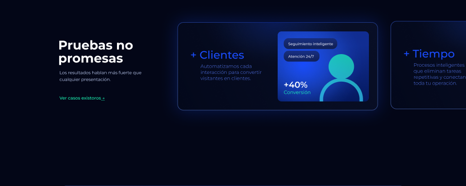

Componente: `src/components/sections/CaseStudies.tsx`  
Contenedor: relleno — · radio 0 · layout — · efectos —

### Textos (17)

| Pos | Texto | Estilo | Familia | Peso | Tamaño | Interlínea | Tracking | Caja | Color | Alineación | Ancho |
|---|---|---|---|---|---|---|---|---|---|---|---|
| 2045,182 | Trabajo manual |  | Montserrat | 400 | 20 | 20 | 0 | — | #1cfcb9 | left/center | 160  |
| 2045,154 | -70% |  | Montserrat | 600 | 35 | 20 | 0 | — | #ffffff | left/top | 120  |
| 2064,303 | Flujo inteligente⏎ |  | Montserrat | 400 | 15 | 15 | 0 | — | #ecefff | left/top | 126  |
| 2064,355 | Procesos automaticos |  | Montserrat | 400 | 15 | 15 | 0 | — | #ecefff | left/top | 172  |
| 1662,198 | + Tiempo |  | Montserrat | 500 | 45 | 48 | 0 | — | #1a4dff | left/top | 355  |
| 1704,256 | Procesos inteligentes que eliminan tareas repetitivas y conectan toda… |  | Montserrat | 300 | 20 | 25 | 0 | — | #597eff | left/top | 237  |
| 1169,368 | Conversión |  | Montserrat | 400 | 20 | 20 | 0 | — | #1cfcb9 | left/center | 115  |
| 1169,340 | +40% |  | Montserrat | 600 | 35 | 20 | 0 | — | #ffffff | left/top | 120  |
| 1188,226 | Atención 24/7⏎ |  | Montserrat | 500 | 15 | 15 | 0 | — | #ecefff | left/top | 126  |
| 1188,174 | Seguimiento inteligente |  | Montserrat | 500 | 15 | 15 | 0 | — | #ecefff | left/top | 192  |
| 240,159 | Pruebas no promesas |  | Montserrat | 700 | 52 | 54 | 0 | — | #ffffff | left/top | 455  |
| 245,287 | Los resultados hablan más fuerte que cualquier presentación.⏎ |  | Montserrat | 400 | 18 | 28 | 0 | — | #c7d7ff | left/top | 390  |
| 784,203 | + Clientes |  | Montserrat | 500 | 45 | 48 | 0 | — | #1a4dff | left/top | 355  |
| 826,261 | Automatizamos cada interacción para convertir visitantes en clientes. |  | Montserrat | 300 | 20 | 25 | 0 | — | #597eff | left/top | 254  |
| 240,394 |  Ver casos existoros → |  | Montserrat | 500 | 18 | 24 | 0 | — | #1cfcb9 | left/top | 508  |
| ↳ |  Ver casos existoros | | = | = | = | = | = | = | #1cfcb9 | | |
| ↳ |  → | | = | = | = | = | = | = | #1cfcb9 | | |

### Contenedores (16)

| Ruta | Nodo | Pos | Tamaño | Radio | Relleno | Borde | Efectos | Layout | Opac. |
|---|---|---|---|---|---|---|---|---|---|
| ·Pruebas no promesas › Frame 234 | Frame 224 (1254:407) | 1609,87 | 826×365 |  |  |  | box-shadow: 0px 0px 150px 0px rgba(26,77,255,0.5) |  |  |
| ·Pruebas no promesas › Frame 234 | Servicio Digital experience (1254:408) | 1609,87 | 826×365 | 25 | linear-gradient(247deg, #101837 0%, #050b21 100%) | conic-gradient(#6994ff 26%, #1a4dff 50%, #6994ff 74%) 2px i… |  | clip | 0.5 |
| ··Frame 234 › Servicio Digital experi… | Vector (1254:409) | 1709,-80 | 626×333 |  | radial-gradient(313px 167px at 50% 50%, #1a4dff 0%, rgba(46,107,255,0.12) 81%, rgba(46,107,255,0) 100%) |  | filter: blur(7.3px) |  |  |
| ·Pruebas no promesas › Frame 234 | Servicio Digital experience (1254:423) | 2020,125 | 376×290 | 16 | linear-gradient(180deg, #1a4dff 21%, #03259b 100%) |  |  | clip |  |
| ··Frame 234 › Servicio Digital experi… | Vector (1254:424) | 1855,12 | 541×475 |  | radial-gradient(271px 238px at 50% 50%, #1a4dff 0%, rgba(46,107,255,0.12) 81%, rgba(46,107,255,0) 100%) |  | filter: blur(7.3px) |  |  |
| ···Servicio Digital experi… › Frame 84 | Rectangle 104 (1254:428) | 2045,287 | 161×45 | 20 | linear-gradient(90deg, #182a6d 0%, #101837 100%) |  |  |  |  |
| ···Servicio Digital experi… › Frame 85 | Rectangle 104 (1254:431) | 2045,339 | 207×45 | 20 | linear-gradient(90deg, #182a6d 0%, #101837 100%) |  |  |  |  |
| ···Servicio Digital experi… › Frame | Vector (1254:434) | 2230,218 | 104×104 |  | linear-gradient(180deg, #1cfcb9 0%, #38d4ff 100%) |  |  |  |  |
| Pruebas no promesas | Frame 87 (541:694) | 731,92 | 826×365 |  |  |  | box-shadow: 0px 0px 150px 0px rgba(26,77,255,0.5) |  |  |
| Pruebas no promesas | Servicio Digital experience (541:695) | 731,92 | 826×365 | 25 | linear-gradient(247deg, #101837 0%, #050b21 100%) | conic-gradient(#6994ff 26%, #1a4dff 50%, #6994ff 74%) 2px i… | box-shadow: 0px 0px 80px 3px rgba(26,77,255,0.5) | clip | 0.5 |
| ·Pruebas no promesas › Servicio Digital experi… | Vector (541:696) | 833,-102 | 600×377 |  | radial-gradient(300px 189px at 50% 50%, #1a4dff 0%, rgba(46,107,255,0.12) 81%, rgba(46,107,255,0) 100%) |  | filter: blur(7.3px) |  |  |
| Pruebas no promesas | Servicio Digital experience (541:699) | 1144,130 | 376×290 | 16 | linear-gradient(180deg, #1a4dff 21%, #03259b 100%) |  |  | clip |  |
| ·Pruebas no promesas › Servicio Digital experi… | Vector (541:700) | 996,24 | 508×475 |  | radial-gradient(254px 238px at 50% 50%, #1a4dff 0%, rgba(46,107,255,0.12) 81%, rgba(46,107,255,0) 100%) |  | filter: blur(7.3px) |  |  |
| ·Pruebas no promesas › Servicio Digital experi… | Rectangle 104 (541:703) | 1169,210 | 147×45 | 20 | linear-gradient(180deg, #182a6d 0%, #101837 100%) |  |  |  |  |
| ·Pruebas no promesas › Servicio Digital experi… | Rectangle 104 (541:705) | 1169,158 | 221×45 | 20 | linear-gradient(180deg, #182a6d 0%, #101837 100%) |  |  |  |  |
| ··Servicio Digital experi… › Frame | Vector (541:708) | 1317,224 | 179×197 |  | linear-gradient(179deg, #1cfcb9 0%, #38d4ff 100%) |  |  |  |  |

_Nodos ocultos: 0 · nodos más profundos que 6: 0_

## 09 · Demo (band:demo) — 1920×831 @ y=9735

Componente: `(n/a — sin diseño todavía: no implementar)`  
Contenedor: relleno — · radio 0 · layout — · efectos —

### Textos (0)

_Sin textos_

### Contenedores (2)

| Ruta | Nodo | Pos | Tamaño | Radio | Relleno | Borde | Efectos | Layout | Opac. |
|---|---|---|---|---|---|---|---|---|---|
| Demo | Rectangle 35 (1272:3967) | 240,0 | 1440×752 | 35 35 0 0 | linear-gradient(180deg, #101a3e 0%, #1a3ba9 100%) | conic-gradient(#6994ff 32%, #1a4dff 50%, #6994ff 68%) 0.5px… |  |  |  |
| Demo | Vector 30 (1272:3968) | 0,752 | 1920×0 |  |  | #6994ff 0.5px inside |  |  |  |

_Nodos ocultos: 0 · nodos más profundos que 6: 0_

## 10 · Calculadora (band:calculadora) — 1920×800 @ y=10566

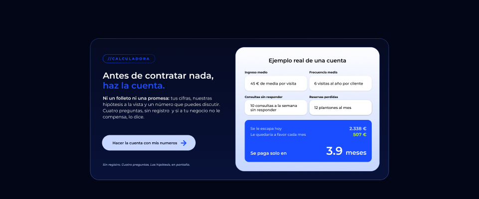

Componente: `src/components/sections/Roi.tsx`  
Contenedor: relleno — · radio 0 · layout — · efectos —

### Textos (28)

| Pos | Texto | Estilo | Familia | Peso | Tamaño | Interlínea | Tracking | Caja | Color | Alineación | Ancho |
|---|---|---|---|---|---|---|---|---|---|---|---|
| 412,224 | //calculadora  |  | Montserrat | 300 | 14 | 22 | 3.5px (0.25em) | — | #1a4dff | center/center | 210  |
| ↳ | // | | = | 700 | = | = | = | = | #1a4dff | | |
| ↳ | calculadora  | | = | 700 | = | = | = | UPPER | #1a4dff | | |
| 944,226 | Ejemplo real de una cuenta |  | Montserrat | 600 | 22 | 23 | 0 | — | #000000 | center/center | 577  |
| 412,277 | Antes de contratar nada, haz la cuenta. |  | Montserrat | 600 | 35 | 40 | 0 | — | #ffffff | left/center | 462  |
| ↳ | haz la cuenta. | | = | = | = | = | = | = | #1a4dff | | |
| 981,282 | Ingreso medio |  | Montserrat | 700 | 12 | 17 | 0 | — | #000000 | left/top | 209  |
| 1240,282 | Frecuencia media |  | Montserrat | 700 | 12 | 17 | 0 | — | #000000 | left/top | 209  |
| 1004,321 | 45 € de media por visita |  | Montserrat | 500 | 15 | 30 | 0 | — | #000000 | left/top | 209  |
| 1260,321 | 6 visitas al año por cliente |  | Montserrat | 500 | 15 | 30 | 0 | — | #000000 | left/top | 209  |
| 981,381 | Consultas sin responder |  | Montserrat | 700 | 12 | 17 | 0 | — | #000000 | left/top | 209  |
| 1240,381 | Reservas perdidas |  | Montserrat | 700 | 12 | 17 | 0 | — | #000000 | left/top | 209  |
| 412,382 | Ni un folleto ni una promesa: tus cifras, nuestras hipótesis a la vis… |  | Montserrat | 400 | 18 | 25 | 0 | — | #ffffff | left/top | 485  |
| ↳ | Ni un folleto ni una promesa:  | | = | 600 | = | = | = | = | = | | |
| ↳ | tus cifras, nuestras hipótesis a la vista y un número que puedes disc… | | = | = | = | = | = | = | = | | |
| 1004,416 | 10 consultas a la semana sin responder |  | Montserrat | 500 | 15 | 17 | 0 | — | #000000 | left/top | 209  |
| 1260,418 | 12 plantones al mes |  | Montserrat | 500 | 15 | 30 | 0 | — | #000000 | left/top | 209  |
| 1004,505 | Se le escapa hoy |  | Montserrat | 500 | 15 | 16 | 0 | — | #c7d7ff | left/center | 276  |
| 1398,507 | 2.338 € |  | Montserrat | 700 | 18 | 16 | 0 | — | #c7d7ff | right/center | 71  |
| 1004,529 | Le quedaría a favor cada mes |  | Montserrat | 500 | 15 | 16 | 0 | — | #c7d7ff | left/center | 256  |
| 1398,531 | 507 € |  | Montserrat | 700 | 18 | 16 | 0 | — | #b8f21e | right/center | 71  |
| 409,563 | Hacer la cuenta con mis numeros |  | Montserrat | 600 | 15 | 16 | 0 | — | #030617 | center/center | 343  |
| 1295,591 |  3.9 meses⏎ |  | Montserrat | 700 | 35 | 30 | 0 | — | #ffffff | right/top | 174  |
| ↳ |   | | = | 600 | 25 | = | = | = | #ffffff | | |
| ↳ | 3.9  | | = | 600 | 45 | = | = | = | #ffffff | | |
| ↳ | meses⏎ | | = | 600 | 25 | = | = | = | #ffffff | | |
| 1004,605 | Se paga solo en  |  | Montserrat | 600 | 18 | 22 | 0 | — | #ffffff | left/top | 167  |
| 412,651 | Sin registro. Cuatro preguntas. Las hipótesis, en pantalla. |  | Montserrat | 500 | 12 | 22 | 0 | — | #c7d7ff | left/top | 409  |

### Contenedores (11)

| Ruta | Nodo | Pos | Tamaño | Radio | Relleno | Borde | Efectos | Layout | Opac. |
|---|---|---|---|---|---|---|---|---|---|
| Calculadora | Rectangle 141 (1259:1708) | 362,155 | 1196×568 | 35 | linear-gradient(180deg, #09112d 0%, #0e1f5c 100%) | conic-gradient(#6994ff 26%, #1a4dff 50%, #6994ff 72%) 1.3px… |  |  |  |
| Calculadora | Rectangle 144 (1259:2020) | 944,190 | 577×498 | 35 | linear-gradient(180deg, #ffffff 0%, #c7d7ff 100%) | rgba(148,178,252,0.5) 1.3px center |  |  |  |
| ·Calculadora › Frame 235 | Servicio Digital experience (1259:1735) | 412,218 | 210×35 | 50 |  | linear-gradient(124deg, #1a4dff 0%, #102e99 100%) 1px inside |  | clip |  |
| ··Frame 235 › Servicio Digital experi… | Vector (1259:1736) | 455,-189 | 507×429 |  | radial-gradient(254px 214px at 50% 50%, #1a4dff 0%, rgba(46,107,255,0.12) 81%, rgba(46,107,255,0) 100%) |  | filter: blur(7.3px) |  |  |
| Calculadora ⧉ Size=Small, Color=Primary con… | Extended FAB (1259:2886) | 981,305 | 250×60 | 16 | #ffffff |  | box-shadow: 0px 1px 4px 0px rgba(12,12,13,0.05), 0px 1px 4px 0px rgba(12,12,13,0.1) | H justify=center align=center clip |  |
| Calculadora ⧉ Size=Small, Color=Primary con… | Extended FAB (1259:2908) | 1240,305 | 250×60 | 16 | #ffffff |  | box-shadow: 0px 1px 4px 0px rgba(12,12,13,0.05), 0px 1px 4px 0px rgba(12,12,13,0.1) | H justify=center align=center clip |  |
| Calculadora ⧉ Size=Small, Color=Primary con… | Extended FAB (1259:2911) | 981,402 | 250×60 | 16 | #ffffff |  | box-shadow: 0px 1px 4px 0px rgba(12,12,13,0.05), 0px 1px 4px 0px rgba(12,12,13,0.1) | H justify=center align=center clip |  |
| Calculadora ⧉ Size=Small, Color=Primary con… | Extended FAB (1259:2912) | 1240,402 | 250×60 | 16 | #ffffff |  | box-shadow: 0px 1px 4px 0px #a7b2d1, 0px 1px 4px 0px rgba(54,54,68,0.1) | H justify=center align=center clip |  |
| Calculadora | Rectangle 140 (1270:3776) | 981,482 | 509×169 | 16 | #1a4dff |  |  |  |  |
| Calculadora | Rectangle 145 (1259:1746) | 409,543 | 375×62 | 47 | #c7d7ff |  |  |  |  |
| ·Calculadora › Arrow right | Icon (I1259:1748;7758:11060) | 727,566 | 19×19 |  |  | #1a4dff 4px center |  |  |  |

_Nodos ocultos: 0 · nodos más profundos que 6: 0_

## 11 · Planes 2026 (band:planes-2026) — 1920×791 @ y=11366

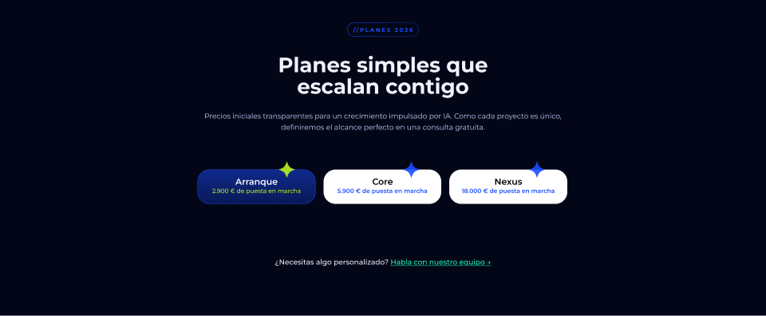

Componente: `src/components/sections/Plans.tsx`  
Contenedor: relleno — · radio 0 · layout — · efectos —

### Textos (18)

| Pos | Texto | Estilo | Familia | Peso | Tamaño | Interlínea | Tracking | Caja | Color | Alineación | Ancho |
|---|---|---|---|---|---|---|---|---|---|---|---|
| 870,63 | //planes 2026 |  | Montserrat | 300 | 14 | 22 | 3.5px (0.25em) | — | #1a4dff | center/center | 180  |
| ↳ | // | | = | 700 | = | = | = | = | #1a4dff | | |
| ↳ | planes 2026 | | = | 700 | = | = | = | UPPER | #1a4dff | | |
| 609,135 | Planes simples que escalan contigo |  | Montserrat | 700 | 52 | 54 | 0 | — | #f1f3fe | center/top | 702  |
| 485,277 | Precios iniciales transparentes para un crecimiento impulsado por IA.… |  | Montserrat | 400 | 18 | 28 | 0 | — | #c7d7ff | center/top | 950  |
| 586,440 | Arranque⏎ |  | Montserrat | 600 | 22 | 30 | 0 | — | #ffffff | center/top | 114  |
| 391,440 | ◇ |  | Inter | 300 | 36 | 26 | 0 | — | #1a4dff | left/center | 40  |
| 495,471 | 2.900 € de puesta en marcha |  | Montserrat | 500 | 15 | 16 | 0 | — | #b8f21e | center/top | 296  |
| 909,440 | Core |  | Montserrat | 600 | 22 | 30 | 0 | — | #000000 | center/top | 100  |
| 707,440 | ◇ |  | Inter | 300 | 36 | 26 | 0 | — | #1a4dff | left/center | 40  |
| 811,471 | 5.900 € de puesta en marcha |  | Montserrat | 600 | 15 | 16 | 0 | — | #1a4dff | center/top | 295  |
| 1224,440 | Nexus |  | Montserrat | 600 | 22 | 30 | 0 | — | #000000 | center/top | 100  |
| 1022,440 | ◇ |  | Inter | 300 | 36 | 26 | 0 | — | #1a4dff | left/center | 40  |
| 1126,471 | 18.000 € de puesta en marcha |  | Montserrat | 600 | 15 | 16 | 0 | — | #1a4dff | center/top | 296  |
| 608,645 | ¿Necesitas algo personalizado? Habla con nuestro equipo → |  | Montserrat | 500 | 18 | 24 | 0 | — | #1cfcb9 | center/top | 704  |
| ↳ | ¿Necesitas algo personalizado? | | = | = | = | = | = | = | #ecefff | | |
| ↳ |   | | = | = | = | = | = | = | = | | |
| ↳ | Habla con nuestro equipo → | | = | = | = | = | = | = | = | | |

### Contenedores (9)

| Ruta | Nodo | Pos | Tamaño | Radio | Relleno | Borde | Efectos | Layout | Opac. |
|---|---|---|---|---|---|---|---|---|---|
| ·Planes 2026 › Frame 217 | Servicio Digital experience (1203:2229) | 870,57 | 180×35 | 50 |  | linear-gradient(128deg, #1a4dff 0%, #102e99 100%) 1px inside |  | clip |  |
| ··Frame 217 › Servicio Digital experi… | Vector (1203:2230) | 908,-350 | 420×429 |  | radial-gradient(210px 214px at 50% 50%, #1a4dff 0%, rgba(46,107,255,0.12) 81%, rgba(46,107,255,0) 100%) |  | filter: blur(7.3px) |  |  |
| ·····Frame › i2 | Vector (1254:351) | 699,405 | 40×40 |  | #b8f21e |  |  |  |  |
| ·····Frame › i2 | Vector (1254:363) | 1011,405 | 40×40 |  | #1a4dff |  |  |  |  |
| ·····Frame › i2 | Vector (1254:387) | 1326,405 | 40×40 |  | #1a4dff |  |  |  |  |
| Planes 2026 | Servicio Digital experience (697:2683) | 495,425 | 296×86 | 30 | linear-gradient(180deg, #1a4dff 0%, #102e99 100%) | #1a4dff 1px inside |  | clip |  |
| Planes 2026 | Servicio Digital experience (1254:354) | 811,425 | 295×86 | 30 | #ffffff |  |  | clip |  |
| Planes 2026 | Servicio Digital experience (1254:378) | 1126,425 | 296×86 | 30 | #ffffff |  |  | clip |  |
| ····Group › Group | Vector (557:3094) | 625,714 | 16×12 |  | #030617 |  |  |  |  |

_Nodos ocultos: 0 · nodos más profundos que 6: 0_

## 12 · Hablemos (band:hablemos) — 1920×509 @ y=12157

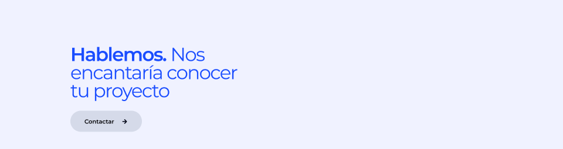

Componente: `src/components/sections/FinalCTA.tsx`  
Contenedor: relleno — · radio 0 · layout — · efectos —

### Textos (3)

| Pos | Texto | Estilo | Familia | Peso | Tamaño | Interlínea | Tracking | Caja | Color | Alineación | Ancho |
|---|---|---|---|---|---|---|---|---|---|---|---|
| 240,171 | Hablemos. Nos encantaría conocer tu proyecto |  | Montserrat | 600 | 65 | 62 | -3.25px (-0.05em) | — | #1a4dff | left/center | 640  |
| ↳ | Nos encantaría conocer tu proyecto | | = | 400 | = | = | = | = | #1a4dff | | |
| 288,405 | Contactar |  | Montserrat | 600 | 20 | 16 | 0 | — | #010104 | left/center | 127  |

### Contenedores (3)

| Ruta | Nodo | Pos | Tamaño | Radio | Relleno | Borde | Efectos | Layout | Opac. |
|---|---|---|---|---|---|---|---|---|---|
| Hablemos | Rectangle 12 (693:2654) | 0,0 | 1920×794 |  | #f0f2ff |  |  |  |  |
| Hablemos | Rectangle 146 (1272:3970) | 240,380 | 244×72 | 47 | #d5dae9 |  |  |  |  |
| ·Hablemos › Arrow right | Icon (I1272:3972;7758:11060) | 419,411 | 13×13 |  |  | #030617 3px center |  |  |  |

_Nodos ocultos: 0 · nodos más profundos que 6: 0_

## 13 · Footer (band:footer) — 1920×285 @ y=12666

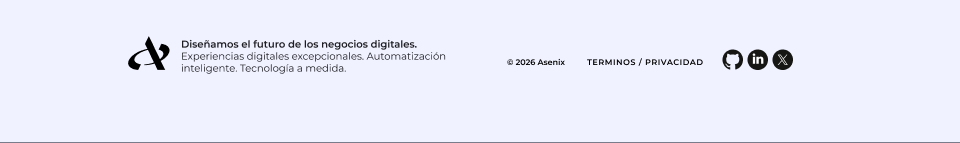

Componente: `src/components/layout/Footer.tsx`  
Contenedor: relleno — · radio 0 · layout — · efectos —

### Textos (5)

| Pos | Texto | Estilo | Familia | Peso | Tamaño | Interlínea | Tracking | Caja | Color | Alineación | Ancho |
|---|---|---|---|---|---|---|---|---|---|---|---|
| 362,84 | Diseñamos el futuro de los negocios digitales.⏎Experiencias digitales… |  | Montserrat | 400 | 20 | 24 | 0 | — | rgba(4,5,10,0.9) | left/center | 582  |
| ↳ | Diseñamos el futuro de los negocios digitales.⏎ | | = | 600 | = | = | = | = | = | | |
| 980,108 | © 2026 Asenix          Terminos / Privacidad |  | Montserrat | 400 | 16 | 66 | 0 | — | #000000 | right/center | 426  |
| ↳ | © 2026 Asenix           | | = | 600 | = | = | = | = | = | | |
| ↳ | Terminos / Privacidad | | = | 600 | = | = | 1.12px (0.07em) | UPPER | = | | |

### Contenedores (7)

| Ruta | Nodo | Pos | Tamaño | Radio | Relleno | Borde | Efectos | Layout | Opac. |
|---|---|---|---|---|---|---|---|---|---|
| ·Footer › Group | Vector (693:2661) | 256,72 | 83×68 |  | #000000 |  |  |  |  |
| ··Frame › Group | Vector (693:2670) | 1445,99 | 41×40 |  | #161614 |  |  |  |  |
| ··Frame › Group | Vector (693:2671) | 1452,128 | 8×5 |  | #161614 |  |  |  |  |
| ·Footer › Frame | Vector (693:2663) | 1495,99 | 41×41 |  | #161614 |  |  |  |  |
| ·Footer › Frame | Vector (693:2664) | 1505,107 | 21×20 |  | #ffffff |  |  |  |  |
| ·Footer › Frame | Vector (693:2666) | 1545,99 | 41×41 |  | #161614 |  |  |  |  |
| ·Footer › Frame | Vector (693:2667) | 1555,109 | 20×21 |  | #ffffff |  |  |  |  |

_Nodos ocultos: 0 · nodos más profundos que 6: 0_

